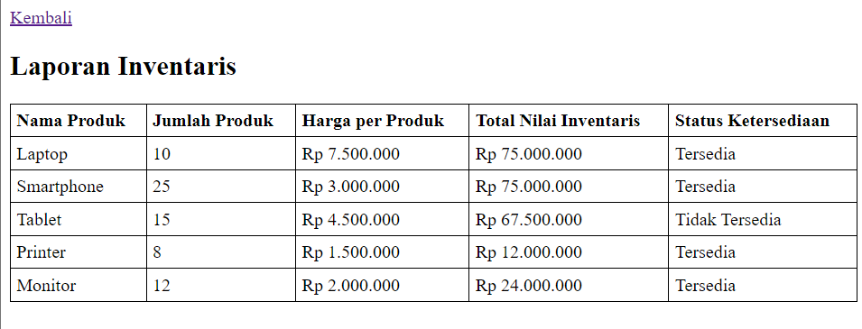
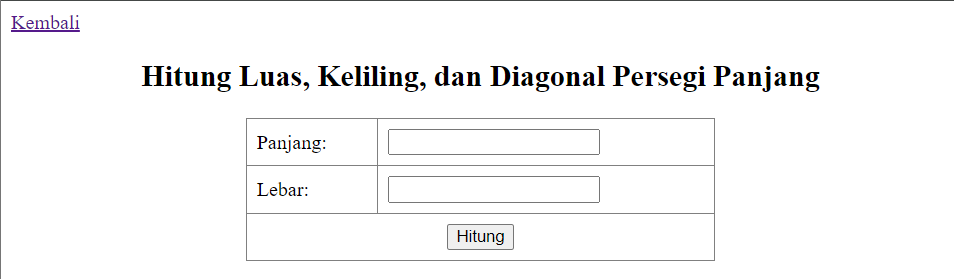
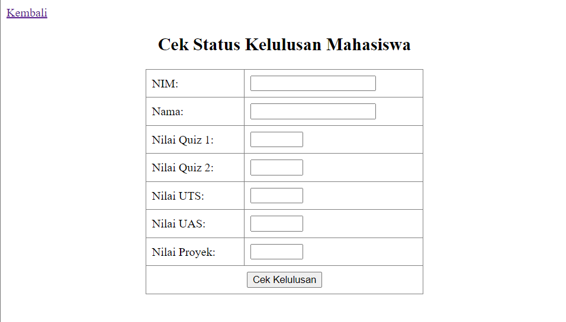

# Pengenalan PHP & Operator
Submission pertemuan ke 5 VSGA Web Developer 2024
## Pertanyaan
1. Apa yang dimaksud type juggling di PHP?  
   

   <strong>Jawaban</strong> 
   Proses untuk menentukan jenis tipe data yang “cocok” untuk operasi saat itu dan PHP akan otomatis mengkonversinya.
   

2. Apakah perbedaan antara operator == dengan === dalam PHP?  
   

   <strong>Jawaban</strong> 
   == (double equals) adalah operator ini membandingkan dua nilai tanpa memperhatikan tipe datanya, sedangkan === (triple equals) adalah operator ini membandingkan dua nilai dengan memperhatikan tipe datanya.
   

   
3. Apa sajakah jenis operator yang menghasilkan nilai boolean?  
   

   <strong>Jawaban</strong> 
   Operator perbandingan: ==, ===, !=, !==, <, >, <=, >=   
   Operator logika: && (AND), || (OR), ! (NOT)
   

4. Apakah perbedaan antara tipe data primitif dengan tipe data objek?  
   

   <strong>Jawaban</strong> 
   Tipe data primitive adalah tipe data dasar yang disediakan langsung oleh bahasa pemrograman dan tidak memiliki properti atau metode. Contoh: integer, float, string, boolean. Tipe data objek adalah tipe data yang lebih kompleks dan dapat memiliki properti dan metode. Objek biasanya didefinisikan dengan menggunakan class. Contoh: objek dari class DateTime.
   
 
## Tugas
1. Laporan Inventaris  
   
2. Menghitung Persegi Panjang  
   
3. Cek Kelulusan Mahasiswa  
   